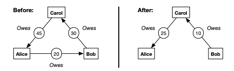
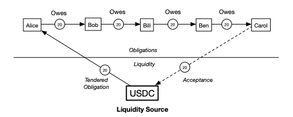

# Cycles Conceptual Model

Cycles proposes a new conceptual model and application architecture for finance and settlement. 
The model proceeds from first principles by combining double-entry bookkeeping and graph theory 
in a novel but remarkably simple way. In Cycles, liquidity is a topological property of the graph. 
Cycles thus enables financial applications to be built with a new kind of generalized capital-efficiency - an ability to systematically do more with less. 

Here you will find more details on the core concepts in Cycles:

- [Summary](#summary)
- [Obligations](#obligations)
- [Acceptances](#acceptances)
- [Tenders](#tenders)
- [Ascertainment](#ascertainment)
- [Settlement](#settlement)
- [Discharge](#discharge)

## Summary

The Cycles model comprises the following set of principles:

1. All agents and currencies are nodes in the graph
2. All nodes are balance sheets
3. All relations between nodes are directed edges in the graph
4. There are two types of edges:

    a. Obligation (from debtor to creditor) - commitment to a past liability

    b. Acceptance (from creditor to debtor) - commitment to a future liability

5. All settlements are cyclic flows in the graph.
6. Settlement of an acceptance spawns an obligation

This is the model motivated and described in the Design section of the Cycles Whitepaper. 
That section is structured around the idea of “4-ways to settle”), 
a fundamental observation about double-entry bookkeeping that seems to have gone largely unnoticed.

Of the six principles above, 1 and 5 represent deep insight into the nature of
the graph. 

*Respect the Graph*

## Obligations

In the Cycles Shielded Graph, the basic objects are not coins but 
rather commitments to liabilities in the past and the future. 
We call a commitment to a liability in
the past an **obligation** and a commitment to a liability in the future an
**acceptance**. Sometimes we will refer to obligations and acceptances jointly as
**graph notes**. Let's start with obligations.

An obligation has a creditor, a debtor, and an amount. It is an asset to
its creditor and a liability to its debtor. We can think of it as an arrow,
representing an amount owed from debtor to credit. 

Fulfillment of an obligation is called **settlement**. 
When an obligation is settled we say that it has been **discharged** - it's
value has been reduced. Discharge can be full or partial.

The foundational insight of Cycles is that obligations that form a closed loop
can be discharged up to the smallest obligation in the cycle, reducing the gross
amount of money actually needed to fully settle them:



Note that the smallest obligation was fully discharged, while the other two were
partially discharged. This is a simple example of size 3, but closed loops like this can come in any size.
We call this kind of settlement **clearing** because the obligations are reduced
("cleared") without the use of any money.

While this is powerful already, we can make Cycles much more powerful by
incorporating a second basic primitive, **acceptances**.


## Acceptances

An acceptance is a commitment to a potential future obligation. 
If an obligation is an existing debt from a debtor to a creditor, 
an acceptance is an extension of credit, from a creditor to a debtor. 
An acceptance is a willingness to lend, and later be owed. 

Like obligations, acceptances can also be settled. But while 
a settled obligation is simply reduced, a settled acceptance is reduced
and a new obligation is spawned in the other direction. We call these literally
**spawned obligations**. Creating an acceptance is like extending a credit
line that hasn't been drawn on yet. Settling an acceptance is drawing on that credit line, spawning the obligation to pay it back.

Thus, both obligations and acceptances can be represented as directed arrows, but
pointing in opposite directions. We use solid lines for obligations and dashed lines for acceptances. 
An obligation is drawn as an arrow **from the debtor to the
creditor**. An acceptance is drawn as an arrow in the other direction, **from the creditor to the debtor**.
A settled acceptance becomes an obligation pointing the other direction.

The figure provides the basic intution of obligations, acceptances,
and their settlement. It depicts a simple payment in Cycles language, which happens every time
Alice pays Bob with bank money. The bank has an obligation to Alice (her money
in the bank), who has one to Bob (the money she owes him for a bill), who has an acceptance to the bank (he's willing to be owed by the bank). After settlement, 
the obligations have been settled and the acceptance from Bob to the Bank has become an obligation from the Bank to Bob. 


This makes clear that:

```admonish tip
Every payment is a cycle
```

The above cycle is what happens every time someone makes a payment. But from the
perspective of Cycles, this is the degenerate case of only two parties and a
single liquidity node. Of course, the point of Cycles isn't to make
simple payments like this, which can be made already in the shielded pool
without any need to represent the obligation on-chain or to represent the
payment as a cycle. Rather the point is to have a dense graph of obligations and acceptances 
that admit large multilateral settlement flows across many participants and liquidity nodes,
clearing more debt with less money for everyone.

Observe that an obligation represents an existing liability 
on the balance sheet of the debtor. It is correspondingly an asset on the balance sheet of the creditor. 
Any kind of digital asset or currency can be represented in this model
as an obligation from a "liquidity node". 

An acceptance represents a potential future liability on the balance sheet of
the debtor, and similarly a potential future asset on the balance sheet of the
creditor. Any kind of credit extension can be
represented as an acceptance. In v1, acceptances do not spawn interest, but they
allow users to accept currencies and to extend interest-free credit to
eachother.

We can represent the entire universe of money and finance with these two basic
primitives and a programmable settlement action. That said, our v1 settlement action is not
yet programmable.

For more, see the [Cycles Whitepaper]

[Cycles Whitepaper]: https://cycles.money/whitepaper.pdf


## Tenders

The basic primitives in the Shielded Graph are Obligations and Acceptances.
There is no direct notion of coins. However coins can always be represented as
an obligation from the coin's "liquidity node". Thus for each coin type, we
create a special "liquidity node" in the graph specific to that coin. The
posession of some coins by a user is represented by an obligation from the
relevant liquidity node to that user's address. Users can also express their willingness
to accept a given coin in payment via an acceptance from their address to the
liquidity node. 

We already saw this in the previous figure about obligations and acceptances with bank
money. Here we have the same idea, but replace the Bank with a USDC liquidity
node and add some more participants:



In Cycles, the obligation from the USDC node to Alice is what we would call tendered funds,
since they are available for settlement. We also refer to it as a tendered
obligation. The tendered obligation, together with the acceptance, allow us to
form a cycle out of what would otherwise just be a chain. Thus Cycles can settle
all the obligations, and transfer Alice's funds to Carol, without Alice and
Carol having anything to do with one another. A small amount of tendered funds can thus help 
clear a much larger amount of debt in the network. 
Tenders and acceptances help dramatically in the creation of larger cycles. 

Coins from the Shielded Pool can be transferred into the Shielded Graph via 
a **Tender** action. Once tendered, the coin seizes to exist in the
shielded pool as a coin and instead exists in the shielded graph as an
obligation from the coin type's liquidity node to the user's address. 
Funds can be removed again from the graph back into the
pool via the **Untender** action.

Tendering funds thus makes them available to participate in clearing - they can
be used as part of a multilateral cycle to settle the user's obligations.
Tendering dramatically increases the potential liquidity saving for everyone. Ultimately,
users who tender funds should be rewarded for the additional liquidity saving
they make possible. Tendering funds is thus a major form of liquidity
provisioning in Cycles.


## Ascertainment

Obligations and acceptances are bilateral relations between two counterparties
that need to be agreed to by each counterparty. I can't just declare that you owe
me without your consent. We call this consent *ascertainment*. For an obligation
or acceptance to be valid, it must be *doubly ascertained*, that is, ascertained
by both parties. In practice, ascertainment amounts to a cryptographic signature
over the relevant data. 

Either a debtor or creditor can create an obligation or acceptance, and
ascertain it themselves. But to be valid, the other counterparty must asertain
as well. 

Liquidity Nodes are special nodes in the graph that allow obligations to be
created from them, and acceptances to be created to them, without double
ascertainment. A user can unilaterally create an obligation from a whitelisted liquidity node
to themselves by tendering funds from the shielded pool - effectively moving their funds from the pool to the graph. 
A user can also unilaterally create an acceptance to a liquidity node, allowing
themselves to get paid in that currency in the graph.

## Settlement

In a graph of obligations and acceptances, every settlement is a cycle in the
graph. We refer to these cycles as **settlement flows**. Any balanced (cyclic)
sub-graph is a valid settlement flow. Settlement flows are computed from the graph by running a flow
algorithm. Thus settlement becomes a graph flow optimization problem, 
and large, multilateral settlements become possible.

We refer to each edge in the settlement flow as a **set-off notice**.
The settlement flow (a balanced batch of set-off notices) can then be applied to the graph on-chain, causing the
relevant obligations and acceptances to be discharged by the specified amount.
For any acceptances discharged, new obligations are spawned in the other
direction. Individual set-off notices must be applied locally to each user's books
off-chain to account for the on-chain settlement of their existing obligations.

Settlement in Cycles is thus the execution of a multilateral settlement flow
against a graph of obligations and acceptances. Each obligation or acceptance
has a corresponding set-off notice that determines how much it was reduced by. 
These set-off notices are legally binding settlement records, just like any other blockchain
payment would be. 

In Cycles, the graph flow optimization algorithm runs off-chain in a *zk-TEE solver* authorized by the protocol.
Obligations and acceptances in the graph are encrypted such that they can be
read by the solver. The solver runs our Multilateral TradeCredit Setoff (MTCS)
algorithm to find an optimal settlement flow. The solver produces a zk-proof
that the flow is correct, encrypts the obligations and acceptances that result
after applying the settlement flow, and broadcasts everything on-chain.

With present cryptographic technology, practical private graph flow optimization
requires Trusted Execution Enclaves (TEEs). Using zk-proofs,
these devices do not need to be trusted for correctness or integrity, but only
for keeping data private to the enclave. Using a light client protocol we can
further restrict the surface area of the TEE as well. See our [Quartz
framework] for more.

[Quartz framework]: https://github.com/informalsystems/quartz


## Discharge

When an obligation or acceptance is reduced, we say it is discharged. 
The primary way to discharge obligations or acceptances is via settlement flows,
as described in the previous section.
However, Cycles allows obligations and acceptances to be discharged directly by users
under certain conditions.

For obligations that were doubly ascertained between two users, only the
creditor can directly discharge. This is equivalent to forgiving the debt, or recording
that it was paid off-chain. However a debtor can discharge the obligation if
they also simultaneously transfer assets in the shielded pool, thereby
paying the obligation without going through a multi-lateral settlement. This is
effectively a normal payment, but it defeats the purpose of having the
obligation in the graph. For tendered obligations (from a liquidity node to a user),
they can be safely discharged via untendering, returning the funds to the user
in the shielded pool. Note that users can technically destroy funds in the graph
by discharging tendered obligations without untendering them - but users always
have the power to burn their on-chain money by sending to inaccessible addresses. 

For acceptances between users, either party can discharge the acceptance (without thus spawning an obligation). 
This is effectively cancelling or reducing the amount of potential credit extended.
