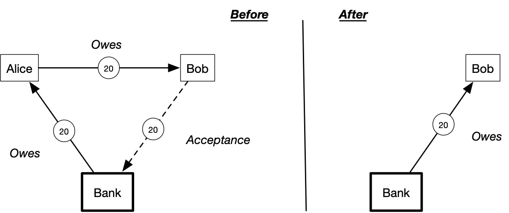

# Acceptances

An acceptance is a commitment to a potential future obligation. 
If an obligation is an existing debt from a debtor to a creditor, 
an acceptance is an extension of credit, from a creditor to a debtor. 
An acceptance is a willingness to lend, and later be owed. 

Like obligations, acceptances can also be settled. But while 
a settled obligation is simply reduced, a settled acceptance is reduced
and a new obligation is spawned in the other direction. We call these literally
**spawned obligations**. Creating an acceptance is like extending a credit
line that hasn't been drawn on yet. Settling an acceptance is drawing on that credit line, spawning the obligation to pay it back.

Thus, both obligations and acceptances can be represented as directed arrows, but
pointing in opposite directions. We use solid lines for obligations and dashed lines for acceptances. 
An obligation is drawn as an arrow **from the debtor to the
creditor**. An acceptance is drawn as an arrow in the other direction, **from the creditor to the debtor**.
A settled acceptance becomes an obligation pointing the other direction.

The figure provides the basic intution of obligations, acceptances,
and their settlement. It depicts a simple payment in Cycles language, which happens every time
Alice pays Bob with bank money. The bank has an obligation to Alice (her money
in the bank), who has one to Bob (the money she owes him for a bill), who has an acceptance to the bank (he's willing to be owed by the bank). After settlement, 
the obligations have been settled and the acceptance from Bob to the Bank has become an obligation from the Bank to Bob. 




This makes clear that:

```admonish tip
Every payment is a cycle
```

The above cycle is what happens every time someone makes a payment. But from the
perspective of Cycles, this is the degenerate case of only two parties and a
single liquidity node. Of course, the point of Cycles isn't to make
simple payments like this, which can be made already in the shielded pool
without any need to represent the obligation on-chain or to represent the
payment as a cycle. Rather the point is to have a dense graph of obligations and acceptances 
that admit large multilateral settlement flows across many participants and liquidity nodes,
clearing more debt with less money for everyone.

Observe that an obligation represents an existing liability 
on the balance sheet of the debtor. It is correspondingly an asset on the balance sheet of the creditor. 
Any kind of digital asset or currency can be represented in this model
as an obligation from a "liquidity node". 

An acceptance represents a potential future liability on the balance sheet of
the debtor, and similarly a potential future asset on the balance sheet of the
creditor. Any kind of credit extension can be
represented as an acceptance. In v1, acceptances do not spawn interest, but they
allow users to accept currencies and to extend interest-free credit to
eachother.

We can represent the entire universe of money and finance with these two basic
primitives and a programmable settlement action. That said, our v1 settlement action is not
yet programmable.

For more, see the [Cycles Whitepaper]

[Cycles Whitepaper]: https://cycles.money/whitepaper.pdf
